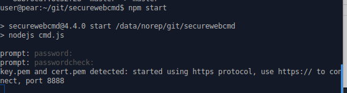
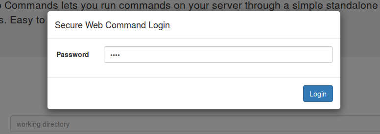
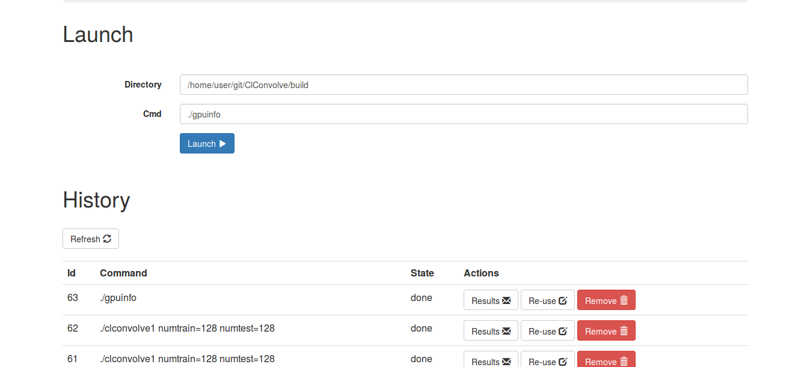
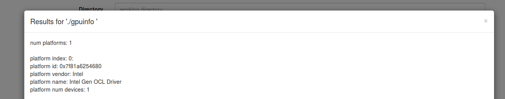

<!-- START doctoc generated TOC please keep comment here to allow auto update -->
<!-- DON'T EDIT THIS SECTION, INSTEAD RE-RUN doctoc TO UPDATE -->
**Table of Contents**  *generated with [DocToc](https://github.com/thlorenz/doctoc)*

- [securewebcmd](#securewebcmd)
- [Using](#using)
  - [Install](#install)
  - [Run](#run)
  - [What if I launch a task while another is already running?](#what-if-i-launch-a-task-while-another-is-already-running)
  - [server-side options](#server-side-options)
    - [How to set options](#how-to-set-options)
    - [Available options](#available-options)
    - [Activate https](#activate-https)
- [Security](#security)
  - [How is it secured?](#how-is-it-secured)
    - [In https mode?](#in-https-mode)
    - [In http mode?](#in-http-mode)
  - [Is my data encrypted during transport, in either direction?](#is-my-data-encrypted-during-transport-in-either-direction)
  - [Is it secure from a man-in-middle attack?](#is-it-secure-from-a-man-in-middle-attack)
  - [If I use https, can people do a man-in-the middle attack etc?](#if-i-use-https-can-people-do-a-man-in-the-middle-attack-etc)
- [What libraries/platforms does it use?](#what-librariesplatforms-does-it-use)

<!-- END doctoc generated TOC please keep comment here to allow auto update -->

# securewebcmd
Execute commands on a linux server through a webpage. Secured using md5 hashing.

Security:
* works with http or https
* password protected
* password not transmitted
* you can use https, which provides protection against replay attacks, and encrypts traffic, in both directions

Functions:
* see history of commands run previously
* watch results of command in real-time, don't have to wait for command to finish running first
* view results of any command, currently running, or historic
* results are persistent, even after server restart
* uses nodejs, simple to install and run
  * doesn't need apache etc ...
* can kill jobs after starting them









# Using

## Install

```bash
npm install -g securewebcmd
```

## Run

From any directory, do:
```bash
securewebcmd
```
... then type in a password of your choice twice

* Connect to the server from a webbrowser, at port 8888, ie [localhost://http:8888](http://localhost:8888)
* Type in the password, same as the one you entered at the server, and 'Login'
* Type in a command, which will run in the same directory where you started securewebcmd, and click 'Launch'
* the command should run, on the server, and the results appear in real-time
* you can kill the job by clicking 'kill' button next to the running job, in the 'History' section
* you can view the results for any job, current or past, by clicking the 'Results' button, next to the job, in the 'History' section

## What if I launch a task while another is already running?

* it will be queued
* it will start once the running task finishes, or if you kill the currently running task

## server-side options

### How to set options

* server-side options are passed in as environment-variables, eg:
```bash
WHITELIST='ls pwd ./gpuinfo' securewebcmd
```

### Available options

| Option | Description |
|---------|-------------|
| PORT=2000 | Change the port that securewebcmd listens on |
| WHITELIST='ls pwd groups ./gpuinfo ./clconvolve1' | Create whitelist of allowed commands.  Note: ignores parameters, so `./clconvolve1` and `./clconvolve1 numtrain=128` will both be allowed by this example |

### Activate https

From the directory where you want to run securewebcmd, do:
```bash
openssl genrsa -out key.pem
#(note: just hit return several times, to accept the defaults)
openssl req -new -key key.pem -out csr.pem
openssl x509 -req -days 9999 -in csr.pem -signkey key.pem -out cert.pem
rm csr.pem
```
... then restart the securewebcmd nodejs server
... and connect to [https://localhost:8888](https://localhost:8888), instead of [http://localhost:8888](http://localhost:8888)
* since it is using a self-signed certificate, you will need to accept the warnings that appear

# Security

## How is it secured?

### In https mode?
* everything is encrypted, by virtue of using https
* all commands, including viewing, and running things, are password-protected (but the password is never sent to the server, just used to create a salted hash)

### In http mode?
* all commands, including viewing, and running things, are password-protected, using password hashes
* so, it would be challenging for someone to run arbitrary commands against the server
* however, in http mode, if someone can sniff the traffic they can:
  * do replay attacks, ie run the same commands over and over again
    * this includes sending viewing any results in the history
  * read all the traffic (except the password)

## Is my data encrypted during transport, in either direction?

Yes, if you use https.  No, if you don't.

## Is it secure from a man-in-middle attack?

Yes, if you use https, and have some way of validating the certificate from the browser side. Otherwise, not.

## If I use https, can people do a man-in-the middle attack etc?

If you have some way of ensuring that the certificate you see from the browser is the one that the server is using, then tricky.  Otherwise, yes.

# What libraries/platforms does it use?

* nodejs
* express
* angular
* jquery
* bootstrap

